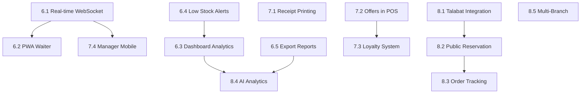

# Market Leadership Specification: Restaurant System — Phases 6, 7 & 8

> **Goal**: Transform the system from a functionally-complete internal tool into the **#1 commercial restaurant management platform in Iraq**.
>
> **Prerequisite**: Phases 1–5 (Schema, RBAC, Business Logic, Cleanup, UI/UX) are ✅ complete.

---

## ⚠️ Global Development Rules

1. **Terminal Usage**: The AI must NEVER execute commands. All commands must be provided to the user to run in a **PowerShell** window.
2. **Database Changes**: No schema changes without explicit user permission and manual migration run.
3. **Security First**: All new Server Actions must use `verifyRole()` from `src/lib/auth-guard.ts`.
4. **RTL First**: All UI components must support Arabic RTL layout by default.

---

## Phase 6: إصلاح الأساس — "Foundation Fixes" (Month 1–2)

> **Priority**: 🔴 Critical — These are blocking commercial adoption.

---

### 6.1 Real-Time Updates (WebSocket via Pusher/Soketi)

**Problem**: When a waiter creates an order, the kitchen screen must be manually refreshed to see it. This causes operational chaos in busy restaurants.

**Target Files**:
- `src/lib/pusher.ts` (**NEW**)
- `src/lib/actions/pos.ts`
- `src/lib/actions/kitchen.ts`
- `src/components/kitchen/kitchen-board.tsx`
- `src/components/tables/table-map.tsx`

**Implementation**:

#### Step 1 — Install dependencies
```powershell
npm install pusher pusher-js
```

#### Step 2 — Create Pusher Client (`src/lib/pusher.ts`)
```typescript
import PusherServer from 'pusher';
import PusherClient from 'pusher-js';

export const pusherServer = new PusherServer({
  appId: process.env.PUSHER_APP_ID!,
  key: process.env.NEXT_PUBLIC_PUSHER_KEY!,
  secret: process.env.PUSHER_SECRET!,
  cluster: process.env.PUSHER_CLUSTER!,
  useTLS: true,
});

export const pusherClient = new PusherClient(
  process.env.NEXT_PUBLIC_PUSHER_KEY!,
  { cluster: process.env.PUSHER_CLUSTER! }
);
```

#### Step 3 — Add `.env` variables
```env
PUSHER_APP_ID=your_app_id
NEXT_PUBLIC_PUSHER_KEY=your_key
PUSHER_SECRET=your_secret
PUSHER_CLUSTER=eu
```

#### Step 4 — Trigger events from Server Actions
```typescript
// In pos.ts after creating order:
await pusherServer.trigger('kitchen', 'new-order', { orderId: order.id });

// In kitchen.ts after updating item status:
await pusherServer.trigger('kitchen', 'order-updated', { orderId });

// In tables.ts after updating table status:
await pusherServer.trigger('tables', 'table-updated', { tableId, status });
```

#### Step 5 — Subscribe in KitchenBoard component
```typescript
// In kitchen-board.tsx
import { pusherClient } from '@/lib/pusher';

useEffect(() => {
  const channel = pusherClient.subscribe('kitchen');
  channel.bind('new-order', () => router.refresh());
  channel.bind('order-updated', () => router.refresh());
  return () => pusherClient.unsubscribe('kitchen');
}, []);
```

**Events to implement**:

| Channel | Event | Triggered When | Subscribers |
|---------|-------|----------------|-------------|
| `kitchen` | `new-order` | Waiter creates order | Kitchen Board |
| `kitchen` | `order-updated` | Chef updates item status | Kitchen Board |
| `tables` | `table-updated` | Table status changes | Table Map |
| `delivery` | `delivery-updated` | Driver updates delivery | Delivery Dashboard |

**Estimated Time**: 3–5 days

---

### 6.2 Progressive Web App (PWA) — Waiter Mobile Interface

**Problem**: Waiters cannot use the system on mobile phones. They need to carry a laptop or tablet between tables, which is impractical.

**Target Files**:
- `next.config.mjs` (update)
- `public/manifest.json` (**NEW**)
- `src/app/waiter/page.tsx` (full rebuild)
- `src/components/waiter/waiter-order-panel.tsx` (**NEW**)

**Implementation**:

#### Step 1 — Install next-pwa
```powershell
npm install next-pwa
```

#### Step 2 — Update `next.config.mjs`
```javascript
import withPWA from 'next-pwa';

const pwaConfig = withPWA({
  dest: 'public',
  register: true,
  skipWaiting: true,
  disable: process.env.NODE_ENV === 'development',
});

export default pwaConfig({
  // ...existing config
});
```

#### Step 3 — Create `public/manifest.json`
```json
{
  "name": "نظام المطعم",
  "short_name": "المطعم",
  "description": "نظام إدارة المطعم",
  "start_url": "/waiter",
  "display": "standalone",
  "background_color": "#ffffff",
  "theme_color": "#f97316",
  "orientation": "portrait",
  "icons": [
    { "src": "/icon-192.png", "sizes": "192x192", "type": "image/png" },
    { "src": "/icon-512.png", "sizes": "512x512", "type": "image/png" }
  ]
}
```

#### Step 4 — Rebuild Waiter Page (`src/app/waiter/page.tsx`)

The waiter page must be rebuilt as a **mobile-first, touch-optimized** interface:

```
Layout:
┌─────────────────────────┐
│  [Table #] [+ New Order] │  ← Header (fixed, 56px)
├─────────────────────────┤
│  [Table 1] [Table 2]... │  ← Horizontal table scroll
├─────────────────────────┤
│                         │
│  Menu Categories Tabs   │  ← Scrollable tabs
│  [Item Cards Grid]      │  ← 2-column grid, 100px cards
│                         │
├─────────────────────────┤
│  [🛒 View Order (3)]    │  ← Floating cart button (4 items)
└─────────────────────────┘
```

**Waiter features**:
- View only tables assigned to them (or all if CAPTAIN)
- Add items to order with single tap
- View and edit current order (slide-up sheet)
- Send to kitchen button
- Request bill button

**Estimated Time**: 1 week

---

### 6.3 Dashboard Analytics (Manager Overview)

**Problem**: The `/dashboard` home page doesn't give managers a real-time overview of operations.

**Target Files**:
- `src/app/dashboard/page.tsx` (major update)
- `src/components/admin/dashboard-stats.tsx` (**NEW**)
- `src/lib/actions/admin.ts` (add `getDashboardStats`)

**Dashboard Widgets to add**:

| Widget | Data Source | Refresh |
|--------|-------------|---------|
| Today's Revenue | `Bill` sum today | On load |
| Active Orders | `Order` where status IN (PENDING, PREPARING, READY) | Real-time |
| Table Occupancy | `Table` count by status | Real-time |
| Delivery Pipeline | `Delivery` count by status | Real-time |
| Low Stock Alert | `RawMaterial` where currentStock ≤ minStockLevel | On load |
| Top 5 Items Today | `OrderItem` grouped by menuItem | On load |

**New Server Action** (`src/lib/actions/admin.ts`):
```typescript
export async function getDashboardStats() {
  await verifyRole(['ADMIN', 'MANAGER']);
  const todayStart = new Date(); todayStart.setHours(0,0,0,0);

  const [revenue, activeOrders, tables, deliveries, lowStock, topItems] =
    await prisma.$transaction([
      prisma.bill.aggregate({ where: { paidAt: { gte: todayStart } }, _sum: { amount: true } }),
      prisma.order.count({ where: { status: { in: ['PENDING','PREPARING','READY'] }, isDeleted: false } }),
      prisma.table.groupBy({ by: ['status'], _count: true }),
      prisma.delivery.groupBy({ by: ['status'], _count: true }),
      prisma.rawMaterial.findMany({ where: { currentStock: { lte: prisma.rawMaterial.fields.minStockLevel } } }),
      // top items query...
    ]);

  return { revenue, activeOrders, tables, deliveries, lowStock, topItems };
}
```

**Estimated Time**: 3 days

---

### 6.4 Low Stock Alerts

**Problem**: The `minStockLevel` field exists on `RawMaterial` but is never used for alerts.

**Target Files**:
- `src/components/layout/global-sidebar.tsx` (add badge)
- `src/components/inventory/inventory-alerts.tsx` (**NEW**)
- `src/lib/actions/inventory.ts` (add `getLowStockItems`)

**Implementation**:
- Add a red badge on the Inventory nav item in the sidebar showing the count of items below `minStockLevel`
- Add an alert banner at the top of `/inventory` page listing low-stock items
- Query: `WHERE currentStock <= minStockLevel AND isDeleted = false`

**New function**:
```typescript
export async function getLowStockItems() {
  return prisma.rawMaterial.findMany({
    where: {
      isDeleted: false,
      currentStock: { lte: prisma.rawMaterial.fields.minStockLevel }
    },
    orderBy: { currentStock: 'asc' }
  });
}
```

**Estimated Time**: 1 day

---

### 6.5 Export Reports to Excel/PDF

**Problem**: The accountant can view reports on screen but cannot export them. Management needs these for external accounting.

**Target Files**:
- `src/components/reports/` — add export buttons to all report components
- `src/lib/utils/export.ts` (**NEW**)

#### Step 1 — Install dependencies
```powershell
npm install xlsx jspdf jspdf-autotable
```

#### Step 2 — Create Export Utility (`src/lib/utils/export.ts`)
```typescript
import * as XLSX from 'xlsx';

export function exportToExcel(data: object[], filename: string) {
  const ws = XLSX.utils.json_to_sheet(data);
  const wb = XLSX.utils.book_new();
  XLSX.utils.book_append_sheet(wb, ws, 'Report');
  XLSX.writeFile(wb, `${filename}.xlsx`);
}
```

#### Step 3 — Add Export Buttons

Add to each report page:
```tsx
<Button variant="outline" onClick={() => exportToExcel(reportData, 'sales-report')}>
  <Download className="ml-2 h-4 w-4" /> تصدير Excel
</Button>
```

**Reports to add export to**:
- `reports/sales-summary` → Excel
- `reports/daily-close` → Excel
- `reports/inventory` → Excel

**Estimated Time**: 1 day

---

## Phase 7: التميز التنافسي — "Competitive Edge" (Month 2–3)

> **Priority**: 🟡 Important for commercial viability.

---

### 7.1 Receipt & Kitchen Printing (ESC/POS)

**Problem**: Restaurants CANNOT operate without printed receipts and kitchen order tickets. This is a hard blocker for adoption.

**Target Files**:
- `src/lib/printing/receipt-template.ts` (**NEW**)
- `src/lib/printing/kitchen-template.ts` (**NEW**)
- `src/app/api/print/route.ts` (**NEW**)
- `src/components/cashier/cashier-view.tsx` (add print button)
- `src/components/kitchen/kitchen-board.tsx` (auto-print on new order)

**Architecture**: Use a **local print server** approach:
- A small Node.js script runs on the restaurant's PC/server
- The Next.js app calls a local API endpoint (or uses `window.print()` for browser printing)

**Browser Print Method** (simplest, no hardware dependency):
```typescript
// receipt-template.ts
export function generateReceiptHTML(order: OrderWithItems, settings: SystemSetting): string {
  return `
    <html dir="rtl">
    <head>
      <style>
        body { font-family: 'Courier New'; width: 80mm; font-size: 12px; }
        .center { text-align: center; }
        .divider { border-top: 1px dashed #000; margin: 4px 0; }
        .total { font-size: 16px; font-weight: bold; }
      </style>
    </head>
    <body>
      <div class="center"><h2>${settings.restaurantName}</h2></div>
      <div class="divider"></div>
      <p>رقم الطلب: #${order.orderNumber}</p>
      <p>التاريخ: ${format(order.createdAt, 'dd/MM/yyyy HH:mm')}</p>
      <p>النادل: ${order.waiter?.name ?? 'كاشير'}</p>
      <div class="divider"></div>
      ${order.items.map(item => `
        <div style="display:flex; justify-content:space-between">
          <span>${item.menuItem.name} x${item.quantity}</span>
          <span>${item.totalPrice.toLocaleString()} ${settings.currency}</span>
        </div>
      `).join('')}
      <div class="divider"></div>
      <div class="total center">
        المجموع: ${order.totalAmount.toLocaleString()} ${settings.currency}
      </div>
      <div class="center" style="margin-top:8px">شكراً لزيارتكم ❤️</div>
    </body>
    </html>
  `;
}

export function printReceipt(html: string) {
  const win = window.open('', '_blank', 'width=400,height=600');
  win?.document.write(html);
  win?.document.close();
  win?.print();
  win?.close();
}
```

**Kitchen Ticket Template**:
```typescript
export function generateKitchenTicketHTML(order: OrderWithItems): string {
  return `
    <html dir="rtl">
    <head>
      <style>
        body { font-family: 'Courier New'; width: 80mm; font-size: 16px; }
        .order-num { font-size: 36px; font-weight: bold; text-align: center; }
        .item { font-size: 20px; margin: 6px 0; }
        .notes { font-style: italic; color: #555; }
      </style>
    </head>
    <body>
      <div class="order-num">#${order.orderNumber}</div>
      <p>الطاولة: ${order.table?.number ?? 'توصيل'} | ${format(order.createdAt, 'HH:mm')}</p>
      <hr />
      ${order.items.map(item => `
        <div class="item">x${item.quantity} ${item.menuItem.name}</div>
        ${item.notes ? `<div class="notes">  ∟ ${item.notes}</div>` : ''}
      `).join('')}
    </body>
    </html>
  `;
}
```

**Estimated Time**: 3–4 days

---

### 7.2 Complete Offers/Discounts in POS

**Problem**: The `Offer` model exists in the database, with `discountPct`, `startDate`, `endDate`, and linked `menuItems`. But it's not applied in the POS during checkout.

**Target Files**:
- `src/lib/actions/pos.ts` (apply offers to order total)
- `src/components/cashier/cashier-view.tsx` (show discount badge, add coupon field)
- `src/lib/actions/menu.ts` (add `getActiveOffers`)

**Implementation**:

```typescript
// In pos.ts — calculateOrderTotal:
export async function getActiveOffers() {
  const now = new Date();
  return prisma.offer.findMany({
    where: { isActive: true, startDate: { lte: now }, endDate: { gte: now } },
    include: { menuItems: { select: { id: true } } }
  });
}

// When building order:
const activeOffers = await getActiveOffers();
items.forEach(item => {
  const offer = activeOffers.find(o => o.menuItems.some(m => m.id === item.menuItemId));
  if (offer) {
    item.unitPrice = item.unitPrice * (1 - offer.discountPct / 100);
    item.totalPrice = item.unitPrice * item.quantity;
  }
});
```

**POS UI Changes**:
- Show orange "خصم X%" badge on item cards that have active offers
- Show discount line in order summary before total
- Optional: manual discount field (percentage or fixed amount) for manager role

**Estimated Time**: 2–3 days

---

### 7.3 Customer Loyalty System (Basic)

**Problem**: Restaurants build repeat business through loyalty programs. Currently, there's no way to track customers or offer rewards.

**Database Changes** (new model — requires migration):
```prisma
model Customer {
  id          String   @id @default(cuid())
  name        String
  phone       String   @unique
  points      Int      @default(0)
  totalSpent  Float    @default(0)
  createdAt   DateTime @default(now())
  orders      Order[]
}
```

**Migration command (user runs)**:
```powershell
npx prisma migrate dev --name "add-customer-loyalty"
```

**Target Files**:
- `prisma/schema.prisma` (add Customer model, link to Order)
- `src/lib/actions/customers.ts` (**NEW**)
- `src/components/cashier/cashier-view.tsx` (add customer lookup before payment)
- `src/app/dashboard/customers/page.tsx` (**NEW**)

**Points Logic**:
- `1 point` per `1,000 IQD` spent
- `100 points` = `5,000 IQD` discount
- Redemption at checkout by cashier

**Estimated Time**: 1 week

---

### 7.4 Manager Mobile View (PWA Extension)

**Problem**: The restaurant owner/manager needs to monitor operations from their phone without being physically present.

**Target Files**:
- `src/app/manager/page.tsx` (**NEW** — mobile manager dashboard)

**Features** (read-only monitoring):
- Today's revenue (live via Pusher)
- Active orders count
- Kitchen queue status
- Delivery pipeline
- Alerts: low stock, long-wait items

**Approach**: Reuse the Dashboard stats but in a mobile-optimized layout, accessible at `/manager`. Add to PWA manifest as a shortcut.

**Estimated Time**: 3 days

---

## Phase 8: الهيمنة على السوق — "Market Dominance" (Month 3–6)

> **Priority**: 🟢 Competitive advantage — sets you apart from ALL competitors.

---

### 8.1 Talabat / External Delivery Platform Integration

**Problem**: Orders from Talabat come to a separate phone/tablet and must be manually re-entered into the system. This causes delays and errors.

**Target Files**:
- `src/app/api/webhooks/talabat/route.ts` (**NEW**)
- `src/lib/actions/delivery.ts` (add `createFromWebhook`)

**Architecture**:
```
Talabat sends order → POST /api/webhooks/talabat
  → Validate webhook signature
  → Map Talabat order fields to internal Order schema
  → prisma.order.create() + prisma.delivery.create()
  → Trigger Pusher event → Kitchen sees it instantly
```

**Webhook Handler**:
```typescript
// src/app/api/webhooks/talabat/route.ts
export async function POST(req: Request) {
  const signature = req.headers.get('x-talabat-signature');
  if (signature !== process.env.TALABAT_WEBHOOK_SECRET) {
    return new Response('Unauthorized', { status: 401 });
  }

  const body = await req.json();
  await createOrderFromExternalPlatform({
    platform: 'TALABAT',
    customerName: body.customer.name,
    customerPhone: body.customer.phone,
    address: body.delivery.address,
    items: body.items.map(mapTalabatItem),
    deliveryFee: body.fees.delivery,
  });

  return new Response('OK', { status: 200 });
}
```

**Estimated Time**: 1–2 weeks (depends on Talabat API access)

---

### 8.2 Public Customer Reservation Page

**Problem**: Customers must call the restaurant to make a reservation. Many abandon if the line is busy.

**Target Files**:
- `src/app/(public)/reserve/page.tsx` (**NEW**)
- `src/app/(public)/reserve/[confirmationId]/page.tsx` (**NEW**)
- `src/lib/actions/reservations.ts` (add `createPublicReservation`)

**Features**:
- Public URL: `yourrestaurant.com/reserve`
- Customer fills: name, phone, date/time, number of guests, notes
- System shows available time slots (based on existing reservations)
- On submit: creates `Reservation` with status `PENDING`
- Captain gets notified via Pusher to confirm or reject
- Customer gets confirmation number

**No login required** for public page.

**Estimated Time**: 1 week

---

### 8.3 Customer Order Tracking Page

**Problem**: Customers who order delivery have no visibility into their order status. They call the restaurant repeatedly.

**Target Files**:
- `src/app/(public)/track/[orderId]/page.tsx` (**NEW**)
- `src/lib/actions/orders.ts` (add `getPublicOrderStatus`)

**Features**:
- Public URL: `yourrestaurant.com/track/ORDER_ID`
- Real-time status updates via Pusher (no login)
- Visual progress: `Received → Preparing → Ready → On the Way → Delivered`
- Estimated delivery time countdown
- Driver phone number (optional)

**Estimated Time**: 3–4 days

---

### 8.4 Advanced Analytics with AI Insights

**Problem**: The current reports are raw numbers. Management needs actionable insights.

**Target Files**:
- `src/app/dashboard/analytics/page.tsx` (**NEW**)
- `src/lib/actions/reports.ts` (add ML-ready aggregations)

**Features**:
- **Peak Hours Analysis**: Heatmap of orders by hour/day of week
- **Menu Performance Matrix**: High profit vs high sales quadrant chart
- **Waste Cost Calculator**: Recipe usage vs manual adjustment (WASTE transactions) cost
- **Revenue Forecasting**: Simple moving average next 7 days
- **AI Suggestions** (via OpenAI API or local):
  - "Consider increasing price of [item] — demand is high"
  - "Stock up on [material] — Friday demand is 3x average"

**Estimated Time**: 2–3 weeks

---

### 8.5 Multi-Branch Support

**Problem**: Successful restaurants expand. The current system supports one restaurant only.

**Database Changes**:
```prisma
model Branch {
  id      String  @id @default(cuid())
  name    String
  address String?
  phone   String?
  users   User[]
  orders  Order[]
  tables  Table[]
}
```

**Target Files**:
- `prisma/schema.prisma` (add Branch model, `branchId` to all major models)
- `src/lib/actions/*.ts` (scope all queries by `branchId`)
- `src/app/dashboard/branches/` (**NEW** — admin branch management)
- `src/components/layout/global-header.tsx` (branch switcher dropdown)

**Key changes**:
- All data queries scoped by `session.user.branchId`
- Super-admin role can see all branches
- Reports filterable by branch or consolidated

**Migration command (user runs)**:
```powershell
npx prisma migrate dev --name "add-multi-branch"
```

**Estimated Time**: 3–4 weeks

---

## Implementation Order & Dependencies



---

## Task Summary Table

### Phase 6 — Foundation Fixes

| ID | Task | Priority | Est. Time | Status |
|----|------|----------|-----------|--------|
| T-6.1 | Real-time via Pusher | 🔴 Critical | 3–5 days | [ ] |
| T-6.2 | PWA Waiter Interface | 🔴 Critical | 1 week | [ ] |
| T-6.3 | Dashboard Analytics Widget | 🟡 Important | 3 days | [ ] |
| T-6.4 | Low Stock Alerts | 🟡 Important | 1 day | [ ] |
| T-6.5 | Export Reports (Excel) | 🟡 Important | 1 day | [ ] |

### Phase 7 — Competitive Edge

| ID | Task | Priority | Est. Time | Status |
|----|------|----------|-----------|--------|
| T-7.1 | Receipt + Kitchen Printing | 🔴 Critical | 3–4 days | [ ] |
| T-7.2 | Offers/Discounts in POS | 🟡 Important | 2–3 days | [ ] |
| T-7.3 | Customer Loyalty System | 🟢 Advantage | 1 week | [ ] |
| T-7.4 | Manager Mobile View | 🟢 Advantage | 3 days | [ ] |

### Phase 8 — Market Dominance

| ID | Task | Priority | Est. Time | Status |
|----|------|----------|-----------|--------|
| T-8.1 | Talabat API Integration | 🟡 Important | 1–2 weeks | [ ] |
| T-8.2 | Public Reservation Page | 🟢 Advantage | 1 week | [ ] |
| T-8.3 | Customer Order Tracking | 🟢 Advantage | 3–4 days | [ ] |
| T-8.4 | AI Analytics Dashboard | 🟢 Advantage | 2–3 weeks | [ ] |
| T-8.5 | Multi-Branch Support | 🟢 Strategic | 3–4 weeks | [ ] |

---

## Verification Plan

### After Phase 6
```powershell
npm run build
```
- [ ] Create order as waiter → kitchen screen updates without refresh
- [ ] Open waiter page on mobile → installs as PWA
- [ ] Dashboard shows live order count, revenue, and low-stock badge
- [ ] Export button on reports → downloads `.xlsx` file

### After Phase 7
- [ ] Complete an order → receipt prints in browser print dialog
- [ ] Add menu item with active offer to POS → discount shown in summary
- [ ] Add customer phone at checkout → points accumulated correctly

### After Phase 8
- [ ] POST to `/api/webhooks/talabat` → order appears in kitchen
- [ ] Visit `/reserve` without login → submit reservation → appears in captain dashboard
- [ ] Visit `/track/[orderId]` → status updates in real-time as kitchen changes order status
