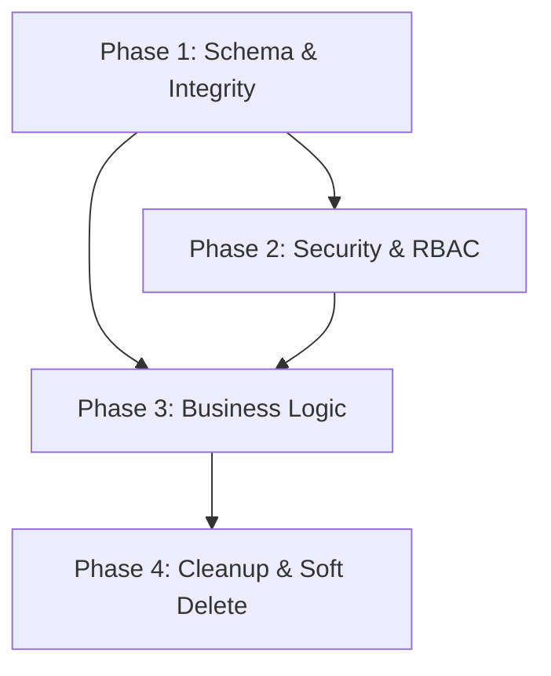

# Master Refactoring Specification: Restaurant Management System

## ⚠️ Global Development Rules

1. **Terminal Usage**: The AI must NEVER execute commands in the integrated terminal. All commands (e.g., `npx prisma migrate dev`) must be provided to the user to run in an external **PowerShell** window.
2. **Database Changes**: No schema changes without explicit user permission.
3. **Security First**: All Server Actions must implement Role-Based Access Control (RBAC).

---

## Phase 1: Database Schema & Integrity

**Target File**: `prisma/schema.prisma`

### 1.1 New Enums

```prisma
enum ReservationStatus {
  PENDING
  CONFIRMED
  COMPLETED
  CANCELLED
  NO_SHOW
}

enum DeliveryStatus {
  PENDING
  ASSIGNED
  PICKED_UP
  ON_THE_WAY
  DELIVERED
  CANCELLED
  RETURNED
}
```

### 1.2 Apply Enums to Models

| Model | Field | Before | After |
|-------|-------|--------|-------|
| `Reservation` | `status` | `String @default("CONFIRMED")` | `ReservationStatus @default(CONFIRMED)` |
| `Delivery` | `status` | `String @default("PENDING")` | `DeliveryStatus @default(PENDING)` |

### 1.3 Reservation ↔ Table: Many-to-Many

```prisma
model Reservation {
  // Remove: tableId String?
  // Remove: table Table? @relation(...)
  tables  Table[] @relation("ReservationTables")  // NEW
}

model Table {
  // Replace: reservations Reservation[]
  reservations Reservation[] @relation("ReservationTables")  // implicit M2M
}
```

### 1.4 Foreign Key Relations (Expense & DailyClose)

```prisma
model Expense {
  // Remove: recordedBy String
  recordedById String?
  recordedBy   User?   @relation("ExpenseRecorder", fields: [recordedById], references: [id])
}

model DailyClose {
  // Remove: closedBy String
  closedById String?
  closedBy   User?   @relation("DailyCloser", fields: [closedById], references: [id])
}

model User {
  // ADD these relations:
  recordedExpenses Expense[]    @relation("ExpenseRecorder")
  dailyCloses      DailyClose[] @relation("DailyCloser")
}
```

### 1.5 Soft Delete Fields

Add to models: `User`, `MenuItem`, `RawMaterial`, `Supplier`, `Order`

```prisma
isDeleted  Boolean   @default(false)
deletedAt  DateTime?
```

### 1.6 Migration Command

> **User must run manually in PowerShell:**
> ```powershell
> npx prisma migrate dev --name "phase1-schema-integrity"
> ```

---

## Phase 2: Security & RBAC (Access Control)

**Target Files**: `src/lib/auth-guard.ts` (NEW), `src/lib/actions/*.ts`

### 2.1 Create Centralized Auth Guard

**New File**: `src/lib/auth-guard.ts`

```typescript
import { auth } from '@/lib/auth';
import { UserRole } from '@prisma/client';

export async function verifyRole(allowedRoles: UserRole[]) {
  const session = await auth();
  
  if (!session?.user?.id) {
    throw new Error('UNAUTHORIZED: Not authenticated');
  }

  const userRole = session.user.role as UserRole;
  
  if (!allowedRoles.includes(userRole)) {
    throw new Error(`FORBIDDEN: Role '${userRole}' not allowed`);
  }

  return {
    userId: session.user.id,
    role: userRole,
    name: session.user.name,
  };
}
```

### 2.2 Apply RBAC to Server Actions

| File | Functions | Allowed Roles |
|------|-----------|---------------|
| `pos.ts` | `createOrder` | ADMIN, MANAGER, CASHIER, CAPTAIN |
| `order-completion.ts` | `completeOrderTransaction` | ADMIN, MANAGER, CASHIER |
| `kitchen.ts` | `updateKitchenItemStatus` | ADMIN, MANAGER, CHEF |
| `finance.ts` | `addExpense`, `deleteExpense` | ADMIN, MANAGER, ACCOUNTANT |
| `finance.ts` | `performDailyClose` (new) | ADMIN, MANAGER |
| `delivery.ts` | `assignDriver`, `updateDeliveryStatus` | ADMIN, MANAGER, DELIVERY_MANAGER |
| `delivery.ts` | `markDeliveriesAsHandedOver` | ADMIN, MANAGER, DELIVERY_MANAGER, ACCOUNTANT |
| `inventory.ts` | all mutations | ADMIN, MANAGER, STORE_MANAGER |
| `reservations.ts` | all mutations | ADMIN, MANAGER, CAPTAIN, WAITER |
| `admin.ts` | all | ADMIN |
| `accountant.ts` | `settleBills` | ADMIN, MANAGER, ACCOUNTANT |
| `menu.ts` | all mutations | ADMIN, MANAGER |

### 2.3 Usage Pattern

```typescript
// Before (no protection):
export async function addExpense(data) {
  await prisma.expense.create({ data: { ...data, recordedBy: 'SYSTEM' } });
}

// After (with RBAC + real user tracking):
export async function addExpense(data) {
  const { userId } = await verifyRole(['ADMIN', 'MANAGER', 'ACCOUNTANT']);
  await prisma.expense.create({ data: { ...data, recordedById: userId } });
}
```

---

## Phase 3: Business Logic & Data Integrity

**Target Files**: `src/lib/actions/order-completion.ts`, `src/lib/actions/finance.ts`

### 3.1 Prevent Negative Stock (`order-completion.ts`)

Add stock validation **before** decrementing:

```typescript
// Inside the transaction, before deducting:
for (const item of order.items) {
  for (const recipeItem of item.menuItem.recipe) {
    const requiredQty = recipeItem.quantity * item.quantity;
    const material = await tx.rawMaterial.findUnique({
      where: { id: recipeItem.materialId },
      select: { currentStock: true, name: true }
    });

    if (!material || material.currentStock < requiredQty) {
      throw new Error(
        `المادة "${material?.name}" غير كافية. المطلوب: ${requiredQty}, المتوفر: ${material?.currentStock ?? 0}`
      );
    }
  }
}
// Then proceed with deductions...
```

### 3.2 Real Accountability (`finance.ts`)

Replace hardcoded `'SYSTEM'`:

```diff
export async function addExpense(data) {
+  const { userId } = await verifyRole(['ADMIN', 'MANAGER', 'ACCOUNTANT']);
   await prisma.expense.create({
     data: {
       ...data,
-      recordedBy: 'SYSTEM'
+      recordedById: userId
     }
   });
}
```

### 3.3 Automate Daily Close (`finance.ts`)

**New Function**: `performDailyClose()`

```typescript
export async function performDailyClose(date?: Date) {
  const { userId } = await verifyRole(['ADMIN', 'MANAGER']);
  
  const targetDate = date || new Date();
  const start = new Date(targetDate); start.setHours(0, 0, 0, 0);
  const end = new Date(targetDate); end.setHours(23, 59, 59, 999);

  // Check if already closed
  const existing = await prisma.dailyClose.findFirst({
    where: { date: { gte: start, lte: end } }
  });
  if (existing) return { error: "تم إغلاق هذا اليوم مسبقاً" };

  // Calculate stats using existing getFinancialStats
  const stats = await getFinancialStats(start, end);

  // Separate CASH vs CARD
  const bills = await prisma.bill.findMany({
    where: { paidAt: { gte: start, lte: end } }
  });
  const totalCash = bills.filter(b => b.paymentMethod === 'CASH').reduce((s, b) => s + b.amount, 0);
  const totalCard = bills.filter(b => b.paymentMethod === 'CARD').reduce((s, b) => s + b.amount, 0);

  await prisma.dailyClose.create({
    data: {
      date: start,
      totalSales: stats.revenue,
      totalCash,
      totalCard,
      totalExpenses: stats.expenses,
      netProfit: stats.netProfit,
      closedById: userId
    }
  });

  revalidatePath('/dashboard/finance');
  return { success: true };
}
```

---

## Phase 4: Code Cleanup & Soft Delete Implementation

**Target Files**: `src/lib/actions/*.ts`

### 4.1 Update Queries

All `findMany` / `findUnique` on soft-deletable models must add:

```typescript
where: { isDeleted: false, /* ...other conditions */ }
```

### 4.2 Convert Hard Deletes to Soft Deletes

```diff
- await prisma.menuItem.delete({ where: { id } });
+ await prisma.menuItem.update({
+   where: { id },
+   data: { isDeleted: true, deletedAt: new Date() }
+ });
```

**Models to convert**: `User`, `MenuItem`, `RawMaterial`, `Supplier`, `Order`

### 4.3 Remove Debug Logs

Remove all `console.log` statements from:
- `src/lib/auth.config.ts` (3 instances)
- `src/lib/actions/reservations.ts` (2 instances)
- `src/lib/actions/accountant.ts` (3 instances)

Replace with proper error-only logging where needed.

### 4.4 Cleanup Root Directory

Move or delete these debug/temp files from the project root:
- `check-orders.js`, `check-user.js`, `debug-*.js`, `fix-categories.js`, `seed-users.js`
- `*.log`, `*-log.txt`, `lint_*.txt`, `tsc_*.txt`

---

## Implementation Order & Dependencies



| Phase | Priority | Estimated Files Changed | Risk |
|-------|----------|------------------------|------|
| 1 | 🔴 Critical | 1 (schema) + migration | Medium (data migration) |
| 2 | 🔴 Critical | 19 (new guard + 18 actions) | Low |
| 3 | 🟡 High | 2 (order-completion, finance) | Medium |
| 4 | 🟢 Normal | 18+ (all actions) | Low |

---

## Verification Plan

### After Phase 1
```powershell
npx prisma migrate dev --name "phase1-schema-integrity"
npx prisma generate
npm run build
```

### After Phase 2
- Test login as each role and verify access restrictions
- Attempt calling protected actions from unauthorized roles

### After Phase 3
- Test order with insufficient stock → should get Arabic error message
- Test Daily Close → verify DailyClose record is created
- Test addExpense → verify `recordedById` is set correctly

### After Phase 4
- Verify deleted items don't appear in lists
- Verify no `console.log` in production builds
- Verify root directory is clean
